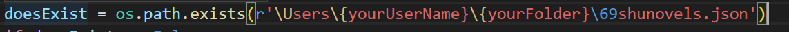
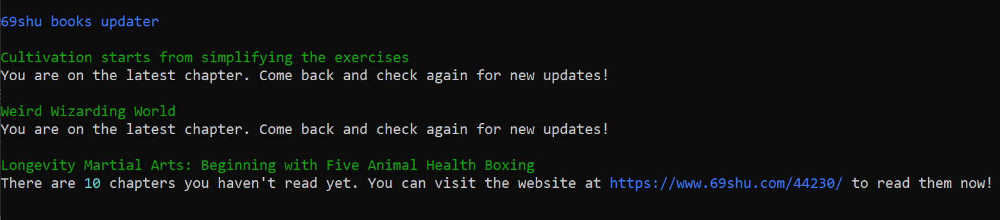

# 69shu.com-book-updater

The python programs helps keeping stats of your favorite novels from a chinese website called 69shu.com. 

## Usage

### Arguments

#### --check : Checking for updates 

example:
  python3 python_chinese_books_updater.py --check y
  
#### --update : Updating json file without chapter number

example:
  python3 python_chinese_books_updater.py --update https://www.69shu.com/txt/42794.htm 

This will update the json file with the novel with the last chapter read set as 1. 

#### --update : Updating json file with chapter number

Another example is updating using chapter number :

example:

  python3 python_chinese_books_updater.py --update https://www.69shu.com/txt/42794.htm --chapter 300

### How to use

- Change the {yourUserName} with something like Paul or whatever your Username is.
- Change {yourFolder} with the folder containing the file. 

For example, if mine was at the Desktop and my username was Alex, then that would make the command r'\Users\Alex\Desktop\69shunovels.json'

## Screenshots

### Checking

