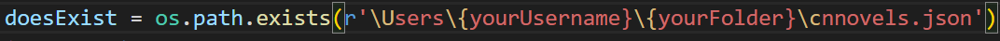

# CN-novel-stat-updater

This python program helps in keeping stats of your favorite novels from the chinese websites called 69shu.com and comrademao.com. I made it because I filled my bookmarks and I can't always open 50 pages. :joy:

## Prerequisites

- rich console (pip install rich)
- requests (pip install requests)
- BeautifulSoup4 (pip install beautifulsoup4)
- GoogleTrans (pip install googletrans==3.1.0a0)
- Selenium for MTLNovel (pip install selenium)

Of course, python3 is needed. The forementioned packages can be installed using 'python3 -m pip install ...' or 'pip3 install ...' 
## Usage

### Arguments

#### --check : Checking for updates 

example:
  python3 python_chinese_books_updater.py --check y
  
#### --link : Updating/Adding link to json file without chapter number

example:
  python3 python_chinese_books_updater.py --link https://www.69shu.com/txt/42794.htm 

This will update the json file with the novel with the last chapter read set as 1. 

#### --link : Updating/Adding link to json file with chapter number

Another example is updating using chapter number :

example:

  python3 python_chinese_books_updater.py --link https://www.69shu.com/txt/42794.htm --chapter 300

### How to use

### Do it twice for line 32 and 70!!!

- Change the {yourUserName} with something like Paul or whatever your Username is.
- Change {yourFolder} with the folder containing the file. 

For example, if mine was at the Desktop and my username was Alex, then that would make the command r'\Users\Alex\Desktop\cnnovels.json'

## Screenshots

### Checking

## Errors

Google Translate has a bug where if you install with pip install googletrans it will show the error:
  
 > AttributeError: 'NoneType' object has no attribute 'group'

If you have that error do:

  $ pip uninstall googletrans
  
  $ pip install googletrans==3.1.0a0
