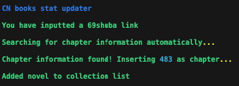
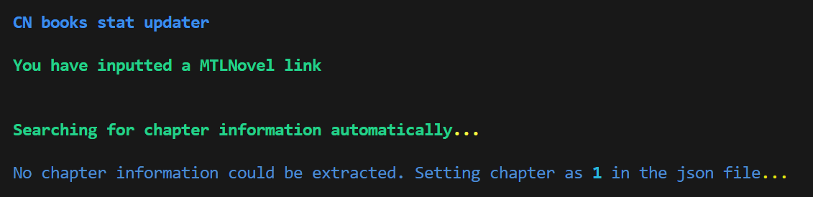
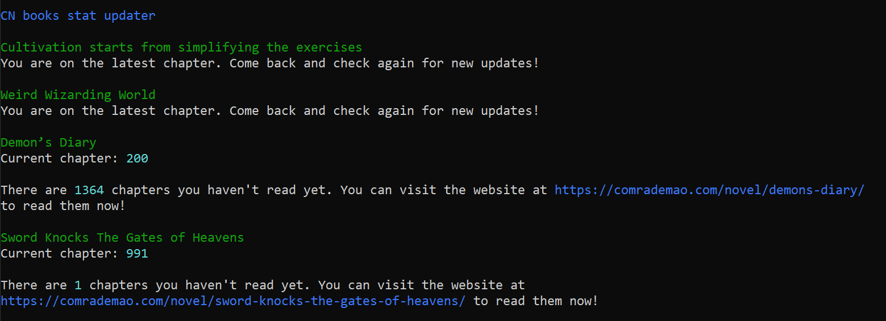
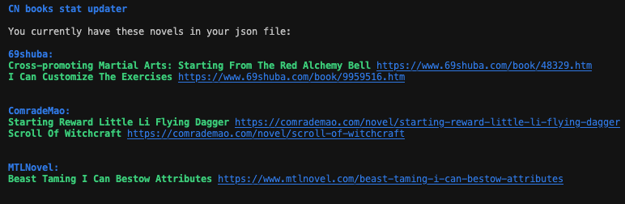
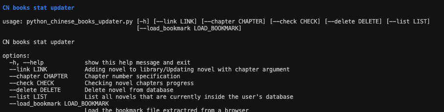
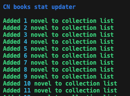
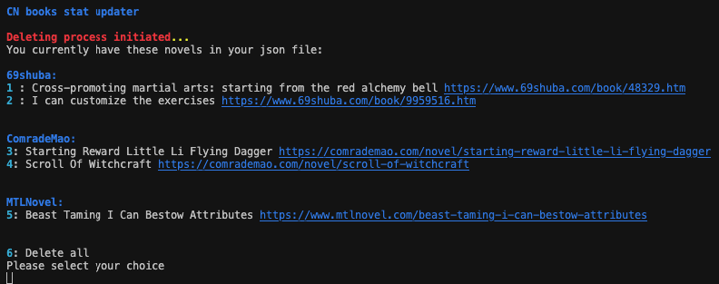

# Chinese novels library / CN novel stat updater

This python script helps in keeping stats of your favorite novels from the chinese novel websites 69shuba.com, MTLNovel.com, Novelfull.com, Novelhi.com and comrademao.com. I made it because I overfilled my bookmarks and I can't always open 50 pages. :joy:

## Prerequisites

- rich console (pip install rich)
- requests (pip install requests)
- BeautifulSoup4 (pip install beautifulsoup4)
- GoogleTrans (pip install googletrans==3.1.0a0)
- Selenium for MTLNovel (pip install selenium)
- Webdriver Manager for MTLNovel (pip install webdriver-manager)
- re (pip install re)

Of course, python3 is needed. The forementioned packages can be installed using 'python3 -m pip install ...' or 'pip3 install ...' 

## Currently supported

 - Comrademao
 - MTLNovel
 - 69shuba
 - NovelFull
 - NovelHi

## Usage

### Arguments

#### -h : Short explanation for the arguments

example:
  > python3 python_chinese_books_updater.py -h 
  
#### --check : Checking for updates 

example:
  > python3 python_chinese_books_updater.py --check y
  
#### --link : Updating/Adding link to json file without chapter number

example:
  > python3 python_chinese_books_updater.py --link https://www.69shuba.com/book/46957.htm 

This will update the json file with the novel with the last chapter read set as 1. 

#### --link : Updating/Adding link to json file with chapter number

Another example is updating using chapter number :

example:

  > python3 python_chinese_books_updater.py --link https://www.69shuba.com/book/46957.htm --chapter 300

#### --delete: Deleting from json file or erasing the whole json file if empty dictionary

example: 
  
  > python3 python_chinese_books_updater.py --delete y

(You can delete with comma seperated values or by a single value. For example, by typing '1,2,3,4' or '2'.)

#### --list: Listing all items in your novel collection/library

example:

  > python3 python_chinese_books_updater.py --list y

#### --load_bookmark: Loading bookmark file (tested with android Chrome)

example:

  > python3 python_chinese_books_updater.py --load_bookmark Bookmarks.json

## Screenshots

### Adding to collection list/Automatic detection 

### Checking

### Listing

### Helping

### Bookmarks

### Deleting

## Bookmarks location

Android chrome bookmarks are located in:

  > root/data/data/com.android.chrome/app_chrome/Default/Bookmarks

I just renamed them to Bookmarks.json, but you can choose not to and use them as is.

## Errors

Google Translate has a bug where if you install with pip install googletrans it will show the error:
  
 > AttributeError: 'NoneType' object has no attribute 'group'

If you have that error do:

  $ pip uninstall googletrans
  
  $ pip install googletrans==3.1.0a0
